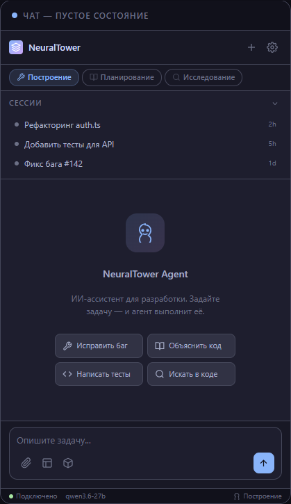
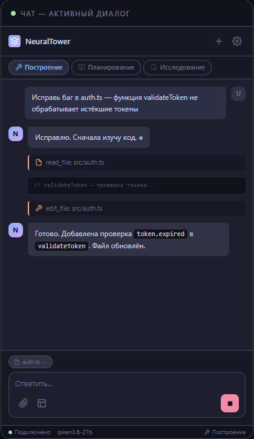

# NeuralTower Agent

Интеллектуальный ассистент для разработки в VS Code, предназначенный для взаимодействия с локальным вычислительным узлом [NeuralTower](https://github.com/momentics/NeuralTower) — открытым проектом настольной AI-рабочей станции. Проект разработан с нуля, без использования кода из сторонних решений. Архитектура и компоненты созданы с акцентом на высокую модульность и слабую связность.

Продукт реализует автономный AI-агент для разработки с концепциями: итеративный агентный цикл, режимы с правами доступа, структурированное планирование, двухуровневая память с компактизацией, расширяемые инструменты (встроенные + MCP), навыки как знания, подагенты для параллелизма, и полный локальный стек без облачных зависимостей.

Агент подключается к серверу NeuralTower (SGLang/vLLM) и поддерживает чтение и запись файлов, поиск по кодовой базе, выполнение команд, а также генерацию сообщений коммитов.

## Системные требования

- VS Code версии 1.85.0 и выше
- Node.js версии 22.0.0 и выше
- npm или аналогичный менеджер пакетов
- Сервер SGLang/vLLM с API, совместимым с OpenAI (будут добавлены расширения NeuralTower)

## Установка зависимостей

```cmd
npm install
```

## Сборка

```cmd
build.bat
```

Скрипт выполняет проверку типов TypeScript, запуск тестов, компиляцию через esbuild и упаковку результата в файл `NeuralTower-Agent-*.*.*.vsix`.

## Очистка

```cmd
clean.bat
```

Скрипт удаляет скомпилированные файлы (`out/`), VSIX-пакеты, промежуточные директории и файлы журналов.

## Установка расширения

После сборки установите VSIX-файл в VS Code:

```cmd
code --install-extension NeuralTower-Agent-*.*.*.vsix
```

Или через интерфейс: **Расширения** > **⋮** > **Установить из VSIX**.

## Настройка

Откройте настройки VS Code и выполните поиск по запросу `NeuralTower Agent`. Основные параметры:

- **Адрес сервера SGLang на узле NeuralTower** — URL сервера вывода (по умолчанию `http://localhost:30000`)
- **Имя модели по умолчанию** — идентификатор модели
- **Максимальное число повторных попыток** — сколько раз запрос будет повторён при ошибке бэкенда
- **Тайм-аут запроса** — время ожидания ответа в миллисекундах
- **Максимум сессий** — максимальное число сохраняемых сессий (по умолчанию `50`)
- **Автоодобрение небезопасных инструментов** — автоматическое одобрение небезопасных вызовов инструментов без запроса подтверждения
- **Список инструментов автоодобрения** — инструменты, одобряемые автоматически даже при выключенном глобальном автоодобрении
- **Максимум итераций агента** — максимальное число вызовов инструментов за один ход агента (по умолчанию `20`)
- **Инъекция контекста Git Diff** — автоматическое добавление изменений в системный промпт агента (по умолчанию вкл.)
- **Autocomplete** — настройки Inline Completion: включение, debounce (по умолчанию `150` мс), лимит токенов (по умолчанию `2048`)
- **Уведомления** — включение/выключение уведомлений VS Code для завершения задач и запросов разрешений

## Горячие клавиши

| Сочетание | Действие |
|-----------|----------|
| `Ctrl+Shift+A` | Перейти к полю ввода чата |
| `Ctrl+Shift+E` | Объяснить выделенный код |
| `Ctrl+Shift+F` | Исправить выделенный код |
| `Ctrl+K Ctrl+A` | Добавить выделение в контекст |
| `Ctrl+Shift+U` | Новый чат |

На macOS вместо `Ctrl` используйте `Cmd`.

## Интерфейс

**Пустое состояние** — стартовый экран с быстрыми действиями:



**Активный диалог** — агент выполняет задачу с использованием инструментов:



## Встроенные инструменты

- **read_file** — чтение содержимого файлов
- **write_file** — запись содержимого в файлы
- **edit_file** — точечная замена текста в файлах
- **delete_file** — удаление файлов и директорий (рекурсивно)
- **create_dir** — создание директорий (с родительскими)
- **move_file** — перемещение и переименование файлов и директорий
- **bash** — выполнение команд оболочки
- **glob** — поиск файлов по шаблону
- **grep** — поиск содержимого по регулярному выражению
- **web_fetch** — загрузка содержимого по URL
- **lsp** — семантический анализ кода через LSP: goToDefinition, findReferences, hover, signatureHelp и др.
- **todowrite** — управление списком задач для многошаговых операций
- **codebase_search** — семантический поиск кода по смыслу, ключевым словам или в гибридном режиме

## Дополнительные возможности

- **Autocomplete** — Inline Completion для кода с настраиваемым debounce и лимитом токенов
- **Codebase Search** — семантический поиск кода: поиск по смыслу, ключевым словам или гибридный режим
- **LSP-интеграция** — семантический анализ через Language Server Protocol
- **MCP** — подключение внешних MCP-серверов для расширения инструментов
- **Навыки (Skills)** — система знаний с автоматической активацией по триггерам
- **Контекстные провайдеры** — 16+ источников контекста: открытые файлы, проблемы, отладчик, терминал, Git Diff, репозиторий и др.
- **Команды для кода** — «Улучшить код» (контекстное меню редактора), «Сгенерировать текст коммита» (панель SCM)

## Используемые архитектурные паттерны

Использовано 11 паттернов проектирования (список обновляется редко и действителен на момент коммита):

- Dependency Injection
- Interface-Driven Design
- Strategy
- Factory
- Repository
- Observer
- Facade
- Template Method
- Tombstone Deletion
- Mutex-Protected Write
- Open/Closed Principle


## Лицензия

MIT
